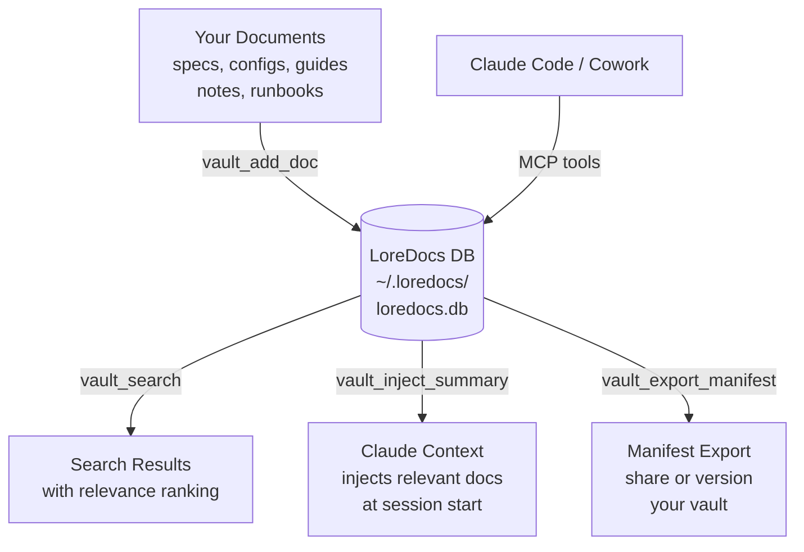

# LoreDocs

> A searchable, organized knowledge base for your AI projects. Store documents, tag them, search across them, and inject context into any Claude conversation.

**By [Labyrinth Analytics Consulting](https://labyrinthanalyticsconsulting.com)**

---

## Quick Install

**Requires [uv](https://docs.astral.sh/uv/getting-started/installation/) -- a fast Python package manager.**

```bash
# Install uv (one time, if you don't have it)
curl -LsSf https://astral.sh/uv/install.sh | sh
```

### Option A: Install from the Labyrinth Analytics marketplace

```bash
# 1. Add the marketplace (one time)
/plugin marketplace add labyrinth-analytics/claude-plugins

# 2. Install the plugin
/plugin install loredocs@labyrinth-analytics-claude-plugins

# 3. Enable the MCP server
/install loredocs
```

### Option B: Add directly as an MCP server

Add to your Claude Code settings (`.claude/settings.json`):

```json
{
  "mcpServers": {
    "loredocs": {
      "command": "uvx",
      "args": ["loredocs"]
    }
  }
}
```

---

## Post-Install Setup

After installing, complete these steps to get the most out of LoreDocs:

### 1. Add CLAUDE.md instructions

Add the following to your project's `CLAUDE.md` or global `~/.claude/CLAUDE.md`:

```markdown
## LoreDocs Knowledge Base

At the start of every session, call `vault_list` then `vault_inject_summary` to load relevant project knowledge.
When you create or update significant documentation, call `vault_add_doc` to store it in the knowledge base.
```

This tells Claude to automatically load project knowledge at session start.

### 2. Mount the data directory (Cowork only)

If you use **Cowork**, mount your LoreDocs data directory so Cowork sessions can access the database:

- Mount `~/.loredocs` as a folder in your Cowork project

Without this step, Cowork sessions cannot read or write to your knowledge vaults.

---

## The Problem

AI projects accumulate knowledge fast -- architecture decisions, API specs, configuration guides, meeting notes, runbooks. That knowledge lives in scattered files, chat histories, and people's heads. When you start a new Claude session, you're starting from scratch.

LoreDocs gives your AI projects a persistent, searchable brain.

---

## How It Works



**Add once, use everywhere.** Store a document in the vault and it's searchable from any Claude session -- Code, Cowork, or Chat (via export).

**Inject on demand.** Ask Claude to inject the vault summary at the start of a session and it automatically loads the most relevant context for the conversation you're about to have.

**Organize by project.** Group documents into named vaults (one per project), tag them, link related docs, and version-track changes over time.

---

## What You Can Store

LoreDocs handles text extraction from all common document types:

- Markdown and plain text (`.md`, `.txt`)
- Word documents (`.docx`)
- PDFs
- Excel spreadsheets (`.xlsx`)
- PowerPoint presentations (`.pptx`)
- Code files and configs

---

## MCP Tools Reference

**Vault management**

| Tool | What it does |
|---|---|
| `vault_create` | Create a new named vault for a project |
| `vault_list` | List all vaults |
| `vault_get` | Get vault details |
| `vault_delete` | Delete a vault and its documents |
| `vault_tier_status` | Check your current tier and limits |

**Document operations**

| Tool | What it does |
|---|---|
| `vault_add_doc` | Add a document to a vault (extracts text automatically) |
| `vault_get_doc` | Retrieve a specific document |
| `vault_list_docs` | List documents in a vault |
| `vault_update_doc` | Update document content or metadata |
| `vault_delete_doc` | Remove a document from the vault |
| `vault_link_doc` | Link two related documents |
| `vault_unlink_doc` | Remove a link between documents |
| `vault_find_related` | Find documents related to a given doc |

**Search and inject**

| Tool | What it does |
|---|---|
| `vault_search` | Full-text search across all vaults or a specific one |
| `vault_inject_summary` | Generate a context summary for Claude to load at session start |
| `vault_export_manifest` | Export a vault manifest for sharing or versioning |
| `vault_suggest` | Proactive suggestions on what context might be relevant |

**Tagging and organization**

| Tool | What it does |
|---|---|
| `vault_add_tag` | Tag a document |
| `vault_remove_tag` | Remove a tag |
| `vault_search_by_tag` | Find all documents with a given tag |
| `vault_get_doc_history` | See version history for a document |
| `vault_restore_doc_version` | Restore a previous version of a document |

---

## Supported Platforms

| Platform | Support | Notes |
|---|---|---|
| **Claude Code** | Full | All 35 MCP tools available |
| **Cowork** | Full | Use vault_inject_summary at session start for automatic context |
| **Chat (web)** | Partial | Use vault_export_manifest and paste output into Chat |

---

## Free vs Pro

| Feature | Free | Pro ($9/mo) |
|---|---|---|
| Vaults | 3 | Unlimited |
| Documents per vault | 50 | Unlimited |
| Document size | 1 MB | 10 MB |
| Version history | 5 versions | Unlimited |
| Search results | Top 10 | All results |
| Export formats | Markdown | Markdown + JSON |

Pro upgrade: [labyrinthanalyticsconsulting.com](https://labyrinthanalyticsconsulting.com)

---

## Companion Product

**[LoreConvo](https://github.com/labyrinth-analytics/loreconvo)** -- Cross-surface persistent memory for Claude sessions. Where LoreDocs stores *documents*, LoreConvo remembers *conversations* -- decisions made, artifacts created, questions left open. They complement each other well.

---

## Data and Privacy

LoreDocs is **local-first**. All data lives in `~/.loredocs/` on your machine. Nothing is sent to any external server. You own your data.

---

## Issues and Feedback

[github.com/labyrinth-analytics/loredocs/issues](https://github.com/labyrinth-analytics/loredocs/issues)
